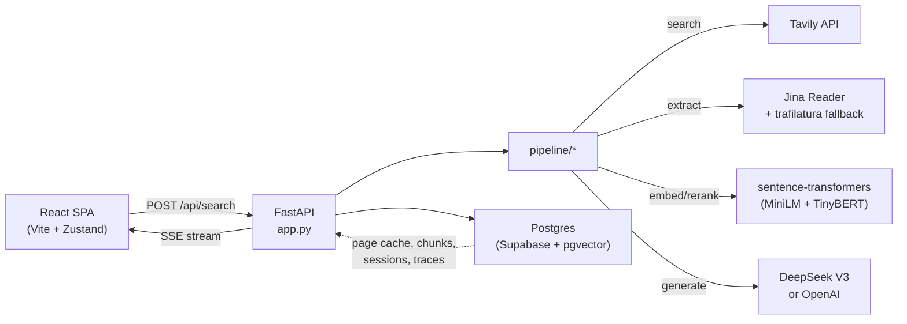
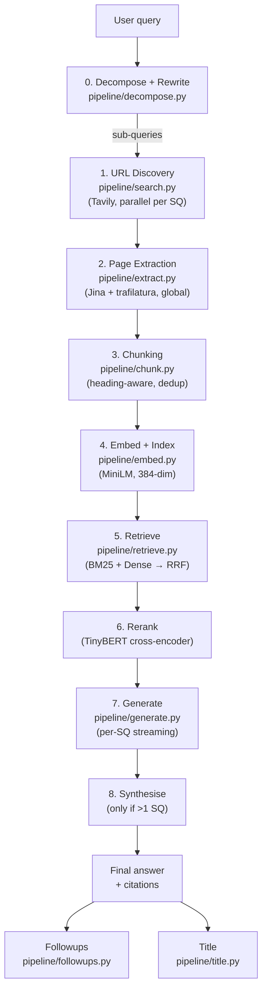
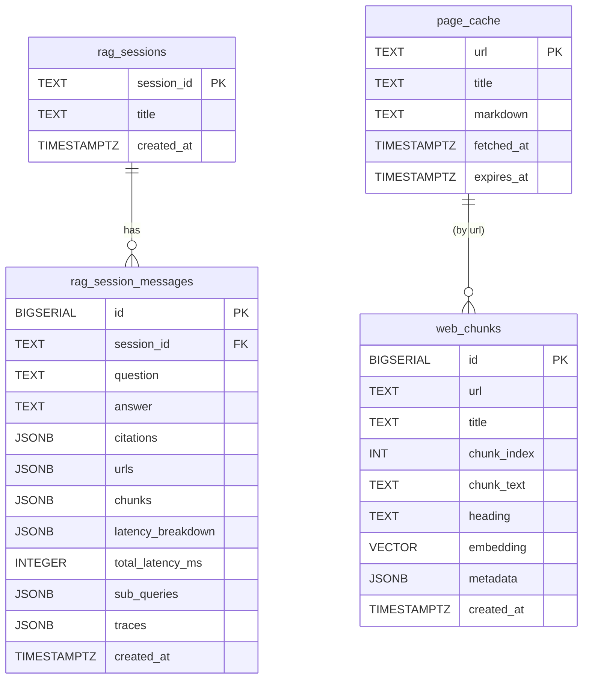

# WebLens Architecture

Current as of v6 (May 2026). For per-version change history see
[OVERALL-IMPROVEMENT-SUMMARY.md](./OVERALL-IMPROVEMENT-SUMMARY.md). For the
on-disk layout see [DIRECTORY-STRUCTURE.md](./DIRECTORY-STRUCTURE.md).

---

## 1. System overview

WebLens is a full-stack web-search RAG system. The backend is a single FastAPI
process that streams a multi-stage pipeline over Server-Sent Events; the
frontend is a React + Vite SPA that mirrors the stream into a live trace
panel and a streaming answer.



Key non-negotiables:

- **Every query passes through the LLM.** No length / shape heuristics. Both
  decompose and rewrite are LLM calls (see v3 / v6 changes).
- **Extraction runs ONCE globally** on the deduplicated URL union, not per
  sub-query. Per-sub-query stats are post-hoc partitions (v6).
- **One global citation map** spans all sub-queries so `[N]` numbers are
  consistent between sub-answers and the final synthesis.
- **Pipeline traces are persisted in JSONB** so reload / chat-switch shows
  the same rich trace as the live stream (v6).

---

## 2. Pipeline (8 stages)



### 0. Decompose + Rewrite — `pipeline/decompose.py`

Two LLM calls, both with today's date injected at runtime:

1. **Rewrite** (only if conversation history exists). The system prompt
   distinguishes anaphoric / fragment / transformation messages (apply prior
   context) from standalone messages (leave unchanged). Negative examples
   defend against topic-shift contamination.
2. **Decompose** the rewritten query into the minimum set of sub-questions.
   The prompt's **Temporal Reasoning** section anchors all date inferences
   to `{today}` instead of training-data defaults.

### 1. URL Discovery — `pipeline/search.py`

Tavily search per sub-query, parallel via `asyncio.gather`. Default
`max_results=6` per sub-query. Results are deduplicated globally by URL but
the `url_to_subqueries` map is preserved (a URL surfaced by 2 sub-queries
keeps both indices) so per-sub-query stats can be computed downstream.

### 2. Page Extraction — `pipeline/extract.py`

Runs **once globally** on the deduplicated URL list. Tries Jina Reader
(`r.jina.ai/{url}`) first, falls back to trafilatura on 4xx/timeout. Hits
the `page_cache` table first; new fetches are written back with a 24h TTL.

Returns `ExtractionResult { pages, failures }` where each failure carries a
`reason ∈ {timeout, http_error, too_short, parse_failed}`.

### 3. Chunking — `pipeline/chunk.py`

Heading-aware markdown chunker. Returns
`(chunks, global_stats, per_url_stats)` — the third tuple element (added
in v6) lets `app.py` partition drop counts back to each URL so
per-sub-query chunk stats are honest.

Configurable: `MAX_CHARS=1500`, `OVERLAP_CHARS=200`, `MIN_CHUNK_BODY=150`.
Drop categories: `garbage_dropped` (boilerplate / nav), `min_body_dropped`
(too short), `dedup_dropped` (near-duplicate from sliding-window overlap).

### 4. Embed + Index — `pipeline/embed.py`

`sentence-transformers` MiniLM (`all-MiniLM-L6-v2`, 384-dim, L2-normalised).
Encoding runs in `loop.run_in_executor(...)` so the event loop stays unblocked
(v3). Device auto-detected (CUDA if available, else CPU). Embeddings are
upserted to `web_chunks` for cross-query reuse.

### 5–6. Retrieve + Rerank — `pipeline/retrieve.py`

```
ALL chunks ─┬─ BM25 → top EMBED_POOL (24)
            └─ embed those 24 + cosine → dense ranks
                                         │
                   BM25 ranks ───────────┼─ RRF (k=60) → CE_POOL (16)
                   dense ranks ──────────┘
                                         │
                              CrossEncoder (TinyBERT) → top TOP_K (8)
                                         │
                              dedup + per-URL cap → final ranked
```

The cross-encoder model is `cross-encoder/ms-marco-TinyBERT-L-2-v2`.
Scoring also runs in an executor.

### 7. Generate — `pipeline/generate.py`

One streaming LLM call per sub-query, multiplexed onto a single `asyncio.Queue`
so all sub-query coroutines stream concurrently into the SSE response (v3).

`_build_prompt` packs source blocks **round-robin across URLs** under
`_PROMPT_CHAR_BUDGET = 48,000` chars (~12k tokens) — replaces the v5
per-URL 6,000-char hard cap that silently dropped chunks (v6).

### 8. Synthesise — `pipeline/generate.py:synthesize_stream`

Only runs when `len(sub_queries) > 1`. Merges sub-answers into a final
markdown answer; the global citation map ensures every `[N]` survives the
synthesis rewrite.

---

## 3. SSE protocol

The backend emits ~16 distinct event names. Frontend handlers in
`frontend/src/state/chatStore.ts` accumulate state per turn.

```
decompose_done        → sub_queries, rewritten_query, mode
search_done           → urls, per_subquery: [{index, urls, count, ...}]
extract_done          → pages, failures, per_subquery: [{index, pages, succeeded, attempted, failures}]
chunk_done            → count, stats, per_subquery: [{index, count, pages, stats}]
embed_done            → candidate_count, device, per_subquery: [{index, candidate_count}]
retrieve_done         → total_chunks, sub_queries
rerank_done           → per_subquery: [{index, top_k, max_score, min_score, explain}]
sub_answer_start (×N) → index, query, chunks, citations, urls
sub_answer_token (×M) → index, text
sub_answer_done  (×N) → index, latency_ms, [error]
synthesis_start       → {} (multi-SQ only)
token            (×M) → text (synthesis-phase tokens)
done                  → session_id, citations, latency_breakdown, followups
error                 → message, reason, [failures]
```

The `per_subquery` arrays on extract / chunk / embed / rerank are the v6
mechanism that makes the per-sub-query trace UI show different numbers per
sub-query (extract+chunk run globally; the array is a post-hoc partition).

---

## 4. Database schema



`rag_session_messages.traces` is a JSONB array of per-sub-query records:
`{index, query, urls, chunks, answer, latency_ms, extract_stats, chunk_stats, embed_count}`.
The last three fields (added v6) carry the per-sub-query slices that drive
chip + drop-breakdown rendering after reload.

`web_chunks` has an IVFFlat index on `embedding vector_cosine_ops` for ANN
search across cached corpora.

Authoritative DDL: [db/schema.sql](../db/schema.sql).

---

## 5. Frontend state model

`frontend/src/state/chatStore.ts` is a single Zustand store. The shape is:

```
ChatStore
├── sessionId, sessions, loadingSessionId
├── pendingInput, isStreaming
├── reactions, selectedVersion          // UI ephemera
└── turns: Turn[]
        ├── id, versionGroupId, versionIndex   // retry / edit grouping
        ├── question, status, errorMsg
        ├── subQueries, subqueries: SubqueryState[]
        │       ├── index, query, steps: ReasoningStep[]
        │       ├── tokens, done, chunks, urls, citations
        │       └── latencyMs, startedAt, completedAt
        ├── pipeline: PipelineGlobals             // wall-clock latencies
        ├── synthesisMd, synthesizing, citations, citationRemap
        ├── followups, rewrittenQuery
        └── totalLatencyMs, createdAt, ...synthesis-phase timestamps
```

Two flows produce identical `ReasoningStep[]` shapes:

1. **Live SSE handlers** (`handleSse`) — fire as events arrive.
2. **`rehydrateSteps`** — rebuilds the trace from a persisted `traces[i]`
   record on session load. Reads the v6-added `extract_stats` /
   `chunk_stats` / `embed_count` to reproduce the rich live trace.

Persistence: only the active `session_id` is in `localStorage`. The actual
turns come from the server (`GET /api/sessions/{id}`); session IDs and
short metadata are listed via `GET /api/sessions`.

---

## 6. UI components

`frontend/src/components/`:

- **ChatPage / ChatThread / ChatInput** — page shell, scrolling thread,
  composer. The thread carries a tail spacer so new questions can always
  scroll to the viewport top (v6).
- **ChatTurn** — one Q+A. Renders the question bubble (with hover icons:
  Edit / Retry / Copy), `ReasoningTrace`, `SubAnswerCard`s, the streamed
  `Answer`, and the followup list.
- **ReasoningTrace + SubqueryTrace + PipelineStep** — collapsible per-turn
  trace. Each `PipelineStep` row optionally expands; the rerank step's
  expansion is the top-N passages list (folded in from the old `ChunksPanel`).
- **Answer** — markdown renderer with inline `[N]` citation buttons.
- **CitationPreview / RetrievedDataPanel** — slide-in side panels for
  drilling into citations or retrieved chunks.
- **Sidebar** — session list, drag-resizable, collapsible to a 40 px rail.
- **Hero / ExamplesDropdown / Header / Logo / InfoPopover** — landing
  affordances.

---

## 7. LLM abstraction

`llm/` provides a thin protocol for streaming completions:

- `llm/base.py` — `LLM` protocol with `acomplete(prompt, system, max_tokens)`
  and `astream(...)` async iterator.
- `llm/deepseek.py` — DeepSeek V3 (default; cheaper).
- `llm/openai_client.py` — OpenAI fallback.

Model selection via `config.py` (env-driven). All pipeline modules call
`get_llm()` — they never instantiate a vendor client directly.

---

## 8. Performance characteristics

Typical end-to-end latency (single sub-query, warm cache):

```
Decompose + Rewrite     200–800ms      (2 LLM calls)
Tavily search          400–1200ms      (parallel per SQ)
Extract                500–2500ms      (parallel; cache hits ~50ms)
Chunk + Embed + Rerank 300–700ms       (BM25 fast, MiniLM batched)
Generate (streaming)  1500–4000ms      (depends on LLM)
Synthesise (multi-SQ) 1000–3000ms      (only if >1 SQ)
─────────────────────────────────────────
Total                 3–7s typical, 10–15s for multi-hop
```

Streaming hides most of the perceived latency — the user sees
`decompose_done` within ~500ms and tokens within ~3s.

---

## 9. Error handling

Each pipeline stage either continues or short-circuits with an `error` SSE
event:

| Stage failure | Behaviour |
|---|---|
| Tavily returns no URLs | `error: no_urls`, persist stub, return |
| All extractions fail | `error: extract_failed`, persist stub, return |
| All pages produce 0 chunks | `error: no_chunks`, persist stub, return |
| One URL extract fails | logged; failure surfaces in extract chip |
| Jina Reader 4xx | trafilatura fallback; if both fail, mark URL failed |
| LLM call fails | sub-answer marked `error`; other sub-queries continue |

Persistence is fire-and-forget — `app.py` schedules `save_message` as a
task so SSE is never blocked. If save fails, the in-memory turn still
renders correctly; only history is missing.

---

## 10. Extensibility hooks

- **Custom retriever** — implement an `async retrieve(...)` returning
  `RankedChunk[]` and swap into `app.py:_pipeline_stream` step 5.
- **Custom LLM** — implement the `LLM` protocol in `llm/`, register in
  `config.py`.
- **Custom chunker** — replace `chunk_pages(pages) → (chunks, stats, per_url_stats)`.
- **Custom decompose prompt** — both prompts are module-level format strings
  in `pipeline/decompose.py`; date injection is at the bottom via `_today()`.
