# WebLens Architecture

## System Overview

WebLens is a full-stack web-search RAG system designed for accuracy through complete page extraction and intelligent retrieval ranking. The architecture emphasizes directness—each pipeline stage is a standalone module with minimal abstraction.

## High-Level Flow

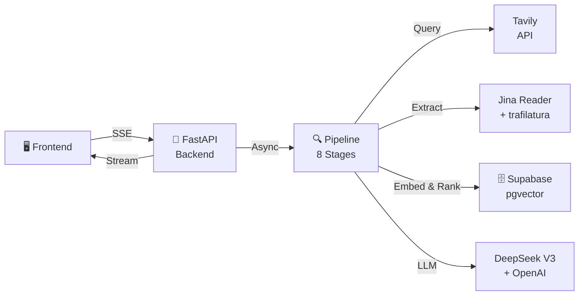

## Pipeline Architecture

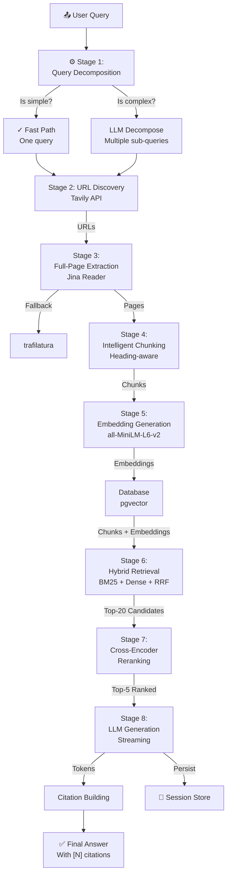

## Stage Details

### Stage 1: Query Decomposition
**Module:** `pipeline/decompose.py`

Determines whether to run the query as-is (fast path) or decompose it into sub-queries:

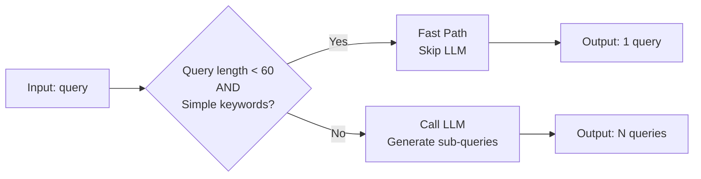

**Decision Logic:**
- If `len(query) < 60` AND LLM returns same query → fast path (0ms extra)
- Otherwise → run full decomposition via LLM (~200ms)

**Output Format:**
```python
{
  "sub_queries": ["Q1", "Q2", ...],
  "original_query": "original",
  "mode": "fast_path" | "llm",
  "latency_ms": int
}
```

---

### Stage 2: URL Discovery
**Module:** `pipeline/search.py`

Uses Tavily API to find relevant URLs. Runs in parallel for each sub-query.

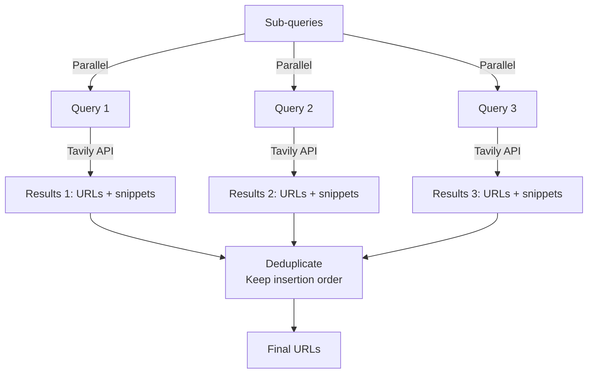

**Key Design:**
- Deduplicates URLs across sub-queries
- Preserves snippet metadata (not used for extraction, only metadata)
- **Critical:** Jina Reader extracts full markdown, NOT Tavily snippets
- Timeout: 30s per query (configurable)

**Output Format:**
```python
[
  {
    "url": "https://...",
    "title": "Page title",
    "snippet": "Summary (metadata only)"
  },
  ...
]
```

---

### Stage 3: Full-Page Extraction
**Module:** `pipeline/extract.py`

Extracts complete page markdown using Jina Reader with trafilatura fallback.

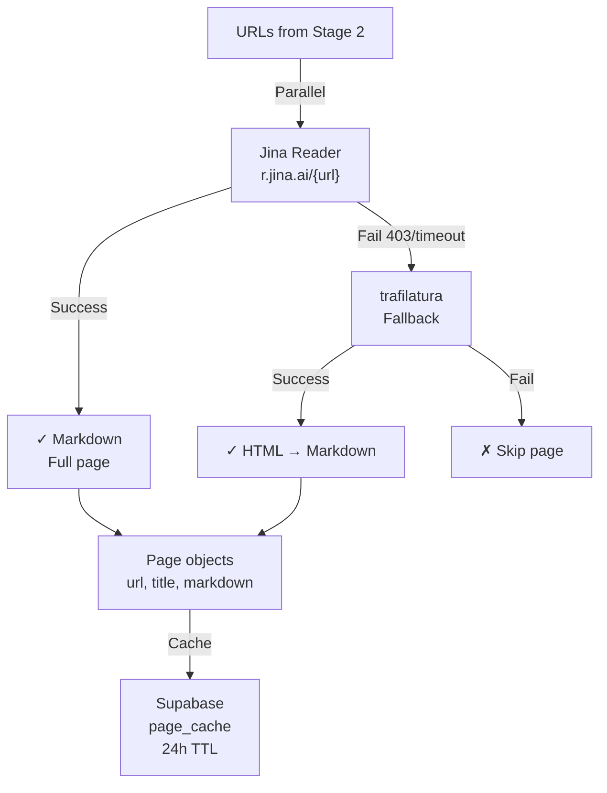

**Cache Strategy:**
- Check `page_cache` for recent URLs
- Only fetch if missing or expired (>24h)
- Store with 24-hour TTL to balance freshness and cost

**Output Format:**
```python
class Page:
  url: str
  title: str
  markdown: str  # Full page content
  fetched_at: datetime
```

---

### Stage 4: Intelligent Chunking
**Module:** `pipeline/chunk.py`

Splits markdown into chunks while preserving heading hierarchy and context.

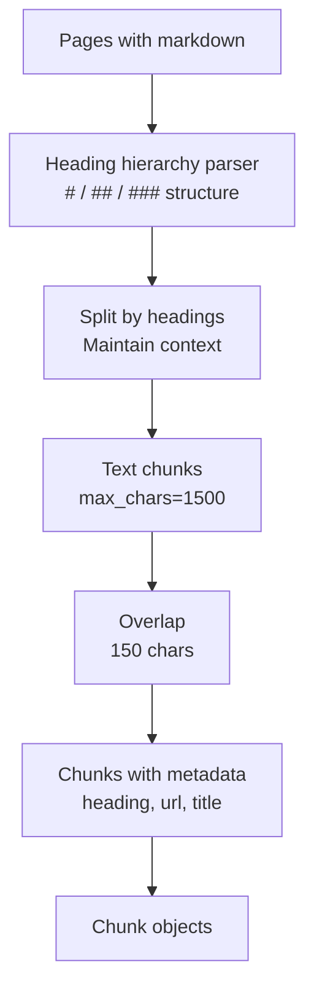

**Configuration:**
- `MAX_CHARS = 1500` — Max chunk size
- `OVERLAP = 150` — Overlap between chunks
- Preserves heading context for every chunk

**Output Format:**
```python
class Chunk:
  url: str
  title: str
  chunk_index: int
  chunk_text: str
  heading: str  # Parent heading
```

---

### Stage 5: Embedding Generation
**Module:** `pipeline/embed.py`

Converts chunks to dense embeddings using `all-MiniLM-L6-v2`.

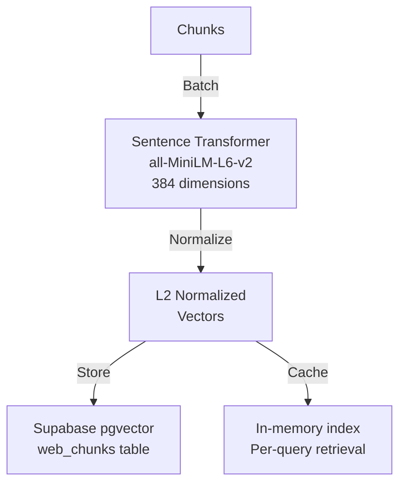

**Key Properties:**
- Model: `all-MiniLM-L6-v2` (fast, 384-dim)
- Normalized: L2 norm for cosine similarity
- Device: GPU if available, else CPU
- Batch size: 32 (configurable for OOM)

**Persistence:**
- Store embeddings in pgvector
- No re-compute on cache hit
- Device info surfaced in SSE event

---

### Stage 6: Hybrid Retrieval
**Module:** `pipeline/retrieve.py`

Combines sparse (BM25) and dense (cosine) retrieval via Reciprocal Rank Fusion (RRF).

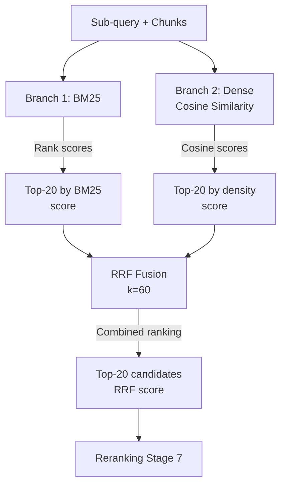

**Algorithm: Reciprocal Rank Fusion (RRF)**

```
RRF_score(i) = sum(1 / (k + rank_i))
              over all ranker methods i
```

- `k = 60` (tuned empirically)
- Combines BM25 and cosine ranks fairly
- Produces top-20 candidates per sub-query

**Output Format:**
```python
class RankedChunk:
  chunk: Chunk
  score: float  # RRF score
  bm25_score: float
  dense_score: float
```

---

### Stage 7: Cross-Encoder Reranking
**Module:** `pipeline/retrieve.py` (end)

Uses cross-encoder to rerank top-20 → top-5 with query-chunk relevance scores.

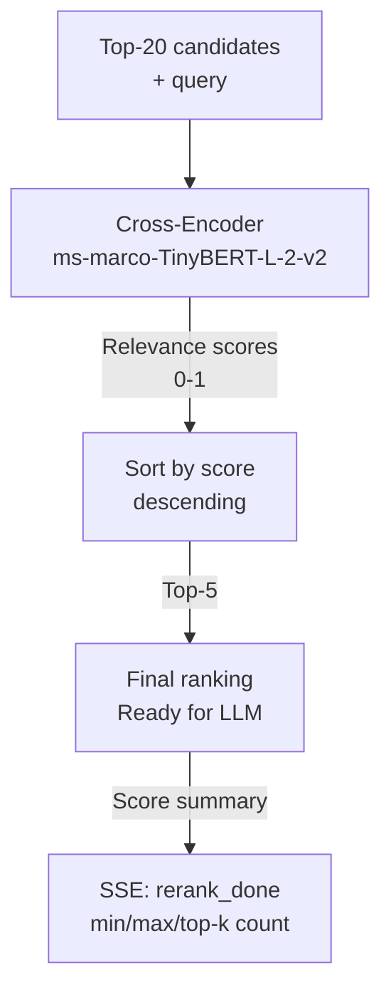

**Model:** `ms-marco-TinyBERT-L-2-v2`
- Fast (<100ms for 20 pairs)
- Trained on MS MARCO dataset
- Outputs single relevance score

**Output:** Top-5 chunks per sub-query

---

### Stage 8: LLM Generation
**Module:** `pipeline/generate.py`

Generates streaming answers using LLM with reranked chunks as context.

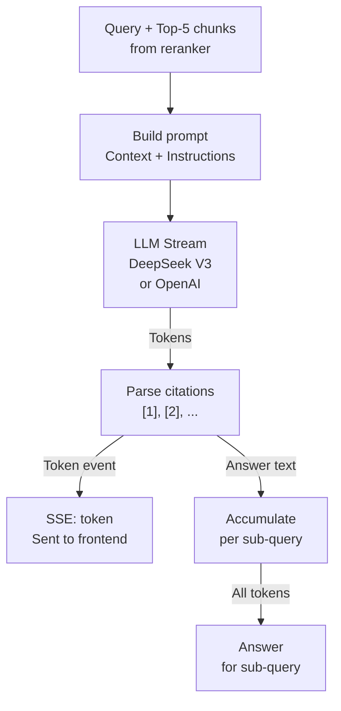

**LLM Selection:**
- **Primary:** DeepSeek V3 (`deepseek-chat`)
- **Fallback:** OpenAI GPT-4o

**Prompt Format:**
```
You are a helpful assistant. Answer the following question using ONLY the provided context.
If the context doesn't contain the answer, say "I don't have enough information."

Context:
[Top-5 chunks formatted with [N] citation markers]

Question: {query}

Answer:
```

**Citation Format:**
- Answer includes `[1]`, `[2]`, etc.
- Citation mapping done in post-processing

---

### Stage 8b: Multi-Query Synthesis
**Module:** `pipeline/generate.py`

If multiple sub-queries were used, synthesize into single answer:

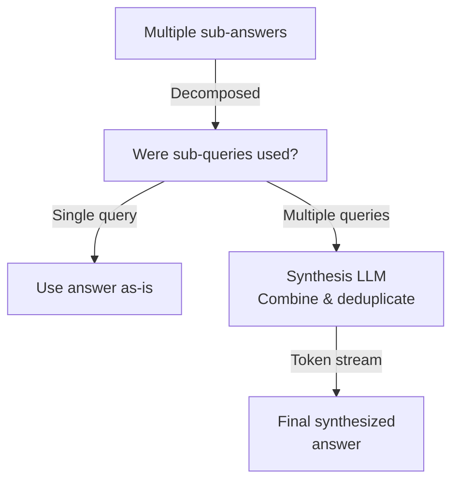

**Synthesis Prompt:**
```
Combine these sub-answers into a coherent response.
Merge duplicate information and maintain citations.

Sub-answers:
[Each with [N] citations]

Combined answer:
```

---

## Database Schema

```mermaid
erDiagram
    CHAT_SESSIONS ||--o{ CHAT_MESSAGES : contains
    CHAT_MESSAGES ||--o{ PAGE_CACHE : references
    PAGE_CACHE ||--o{ WEB_CHUNKS : contains
    
    CHAT_SESSIONS {
        uuid id PK
        text title
        timestamp created_at
        timestamp updated_at
    }
    
    CHAT_MESSAGES {
        bigserial id PK
        uuid session_id FK
        text question
        text answer
        jsonb citations
        jsonb urls
        jsonb chunks
        jsonb traces
        jsonb latency_breakdown
        int total_latency_ms
        timestamp created_at
    }
    
    PAGE_CACHE {
        text url PK
        text title
        text markdown
        timestamp fetched_at
        timestamp expires_at
    }
    
    WEB_CHUNKS {
        bigserial id PK
        text url FK
        text title
        int chunk_index
        text chunk_text
        text heading
        vector embedding
        jsonb metadata
        timestamp created_at
        unique "url, chunk_index"
    }
```

---

## Streaming Protocol

The backend streams 9+ event types via SSE. Frontend accumulates state:

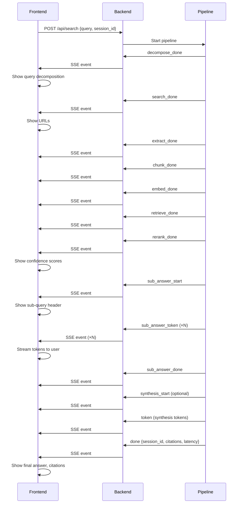

---

## Error Handling

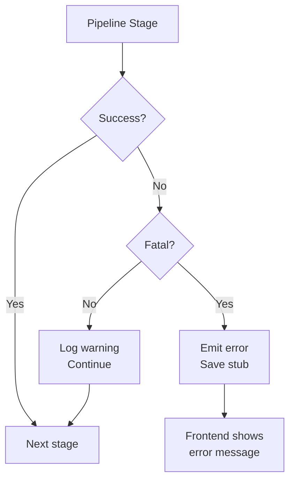

**Fatal Errors:**
- No URLs found
- No pages extracted
- No chunks generated

**Non-Fatal (logged):**
- Single URL extraction fails
- Jina Reader timeout → trafilatura fallback

---

## Performance Characteristics

```
Query Decomposition:    0-300ms   (0ms if fast_path)
URL Discovery:          500-1500ms  (parallel)
Page Extraction:        1000-3000ms (parallel, cached)
Chunking:               50-200ms    (linear in content)
Embedding:              100-500ms   (batched, GPU if available)
Retrieval:              200-500ms   (RRF + rerank)
Generation:             2000-5000ms (depends on LLM)
─────────────────────────────────────────────────────
Total (typical):        4-6 seconds
```

Bottleneck: LLM generation (streaming improves perceived latency).

---

## Extensibility

### Adding a Custom Retriever
```python
# pipeline/retrieve.py
async def custom_retrieve(query: str, chunks: list, top_k: int) -> list:
    """Your retriever here."""
    ranked = [RankedChunk(chunk=c, score=s) for c, s in ...]
    return ranked[:top_k]
```

Then update `Stage 6` to call it.

### Swapping the LLM
```python
# pipeline/generate.py
async def generate_stream(query: str, ranked_chunks: list):
    """Swap to your LLM."""
    async for token in your_llm.stream(prompt):
        yield token
```

### Custom Chunking Strategy
```python
# pipeline/chunk.py
def chunk_pages(pages: list) -> list:
    """Your chunking logic here."""
    return chunks
```

All modules are designed to be replaced independently.

---

## Deployment Considerations

- **Environment Variables:** 7 required (see [DEPLOYMENT.md](./DEPLOYMENT.md))
- **Database:** Requires pgvector extension
- **LLM Cost:** ~$0.01–0.05 per query (DeepSeek cheaper than OpenAI)
- **Embedding Cost:** ~$0.000003 per 1K chunks (one-time)
- **Caching:** 24h page cache reduces extraction costs

---

## Diagrams Legend

- 🖥️ Frontend
- 🔄 Processing
- 🔍 Search
- 📄 Content
- 📊 Data/ML
- 💬 Generation
- 🗄️ Database
- ✅ Output
- ⚙️ Configuration
