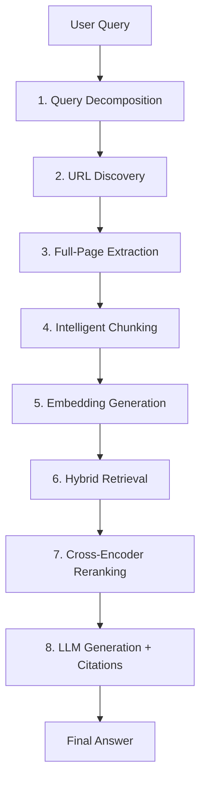

# RAG Model Pipeline: WebLens

> A step-by-step breakdown of the Retrieval-Augmented Generation (RAG) pipeline powering WebLens, with model choices, data flow, and design rationale.

---

## 🧩 Pipeline Overview

The WebLens RAG pipeline is an 8-stage, modular system designed for high-accuracy, citation-grounded answers. Each stage is a standalone module, enabling direct testing and easy debugging.

### High-Level Flow

---

## 1️⃣ Query Decomposition

- **Goal:** Split complex queries into atomic sub-queries for better coverage.
- **How:**
  - If query is short/simple: use as-is (fast path)
  - Else: LLM (DeepSeek/OpenAI) generates sub-queries
- **File:** `pipeline/decompose.py`
- **Output:** `{ sub_queries: [Q1, Q2, ...], mode: "fast_path" | "llm" }`

---

## 2️⃣ URL Discovery

- **Goal:** Find relevant web pages for each sub-query.
- **How:** Tavily API (parallel for each sub-query)
- **File:** `pipeline/search.py`
- **Output:** `[ { url, title, snippet }, ... ]` (deduplicated)

---

## 3️⃣ Full-Page Extraction

- **Goal:** Extract complete markdown from each URL (not just snippets).
- **How:**
  - Try Jina Reader (r.jina.ai)
  - Fallback: trafilatura (local HTML extraction)
  - Cache results (24h TTL)
- **File:** `pipeline/extract.py`
- **Output:** `[ { url, title, markdown }, ... ]`

---

## 4️⃣ Intelligent Chunking

- **Goal:** Split markdown into context-preserving chunks.
- **How:**
  - Parse heading hierarchy (#, ##, ###)
  - Split by headings, max 1500 chars, 150-char overlap
- **File:** `pipeline/chunk.py`
- **Output:** `[ { url, title, chunk_index, chunk_text, heading }, ... ]`

---

## 5️⃣ Embedding Generation

- **Goal:** Convert chunks to dense vectors for semantic search.
- **Model:** `all-MiniLM-L6-v2` (sentence-transformers, 384-dim)
- **How:**
  - Batch encode chunks (GPU if available)
  - L2-normalize for cosine similarity
- **File:** `pipeline/embed.py`
- **Output:** `[ { chunk_id, embedding }, ... ]` (stored in pgvector)

---

## 6️⃣ Hybrid Retrieval

- **Goal:** Retrieve top candidate chunks using both sparse and dense methods.
- **How:**
  - BM25 (TF-IDF) for keyword match
  - Dense vector search for semantic match
  - Combine with Reciprocal Rank Fusion (RRF)
- **File:** `pipeline/retrieve.py`
- **Output:** `Top-20 candidate chunks`

---

## 7️⃣ Cross-Encoder Reranking

- **Goal:** Precisely rank top candidates for LLM context.
- **Model:** `ms-marco-TinyBERT-L-2-v2` (cross-encoder)
- **How:**
  - For each candidate: cross-encoder predicts relevance (query, chunk)
  - Sort and select top-5
- **File:** `pipeline/retrieve.py`
- **Output:** `Top-5 ranked chunks`

---

## 8️⃣ LLM Generation + Citations

- **Goal:** Generate a grounded answer with citations.
- **Model:** DeepSeek V3 (primary), OpenAI (fallback)
- **How:**
  - Build prompt with top-5 chunks (with headings, citation markers)
  - Stream answer tokens to frontend (SSE)
  - Track which chunks are cited
- **File:** `pipeline/generate.py`
- **Output:** `{ answer, citations: [ { url, heading, excerpt } ] }`

---

## 🛠️ Model Choices & Rationale

| Stage         | Model/Tech                | Why?                                   |
|---------------|--------------------------|----------------------------------------|
| Decompose     | DeepSeek/OpenAI LLM      | Handles complex queries                |
| URL Discovery | Tavily API               | Best free web search                   |
| Extraction    | Jina Reader, trafilatura | Full-page, robust fallback             |
| Embedding     | all-MiniLM-L6-v2         | Fast, accurate, low resource           |
| Retrieval     | BM25 + Dense + RRF       | Hybrid = best of both worlds           |
| Reranking     | ms-marco-TinyBERT        | High-precision, small, fast            |
| Generation    | DeepSeek V3 / OpenAI     | Fast, streaming, reliable fallback     |

---

## 📈 Data Flow Example

1. **User:** "Compare BM25 and TF-IDF for text retrieval"
2. **Decompose:** ["What is BM25?", "What is TF-IDF?", "Comparison of BM25 and TF-IDF"]
3. **Search:** Tavily finds URLs for each sub-query
4. **Extract:** Jina Reader/trafilatura fetches full markdown
5. **Chunk:** Pages split into heading-aware chunks
6. **Embed:** Chunks embedded, stored in pgvector
7. **Retrieve:** Hybrid search + RRF → top-20
8. **Rerank:** Cross-encoder → top-5
9. **Generate:** LLM streams answer, citing relevant chunks

---

## 🚀 Design Principles

- **Full-page context** beats snippets for answer quality
- **Hybrid retrieval** (BM25 + dense) is more robust
- **Cross-encoder reranking** maximizes precision
- **Streaming** (SSE) for real-time UX
- **Caching** (pages, embeddings) for speed and cost
- **No abstraction layers** — each stage is a testable module

---

## 📚 References

- [ARCHITECTURE.md](ARCHITECTURE.md) — System architecture
- [DEPLOYMENT.md](DEPLOYMENT.md) — Deployment guide
- [implementation-summary-v5.md](implementation-summary-v5.md) — UI/UX improvements
- [how-to-run.md](how-to-run.md) — Local setup

---

**For interview and documentation use.**